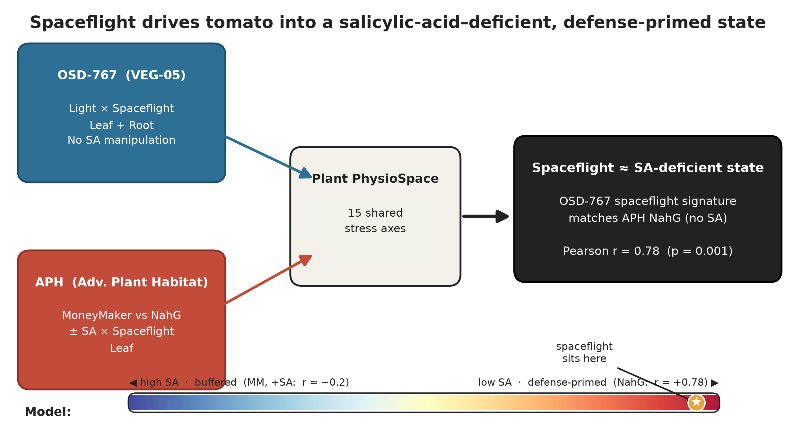
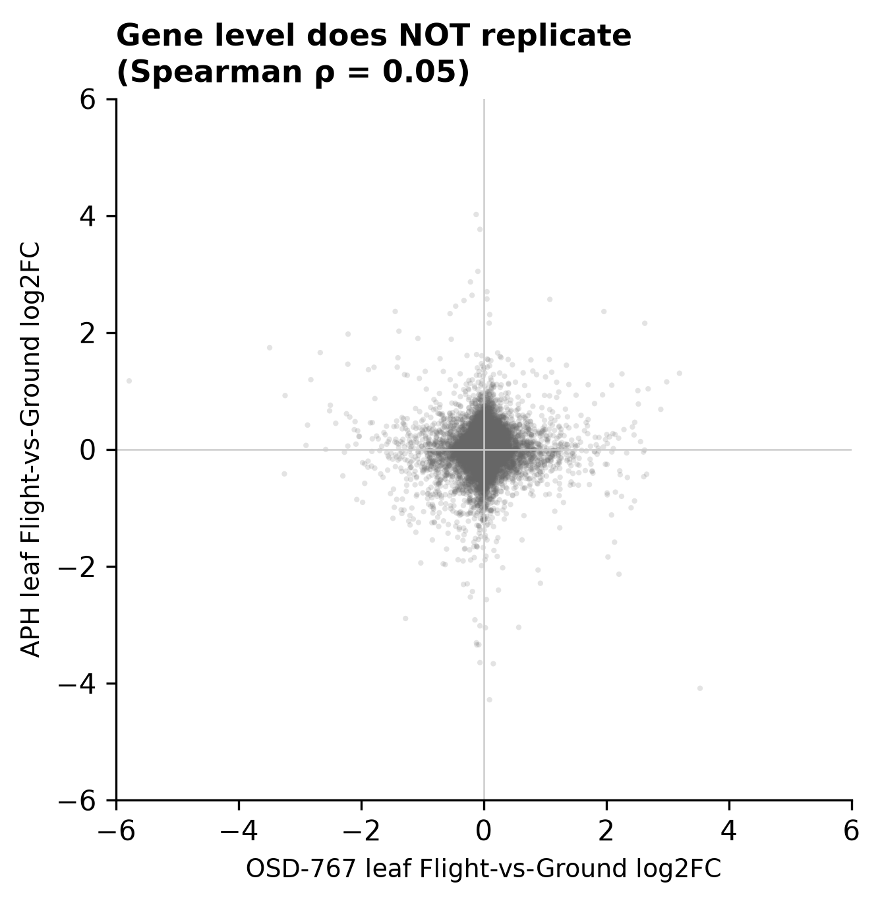
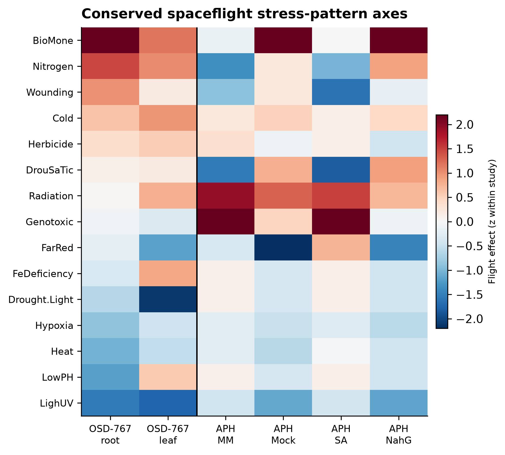
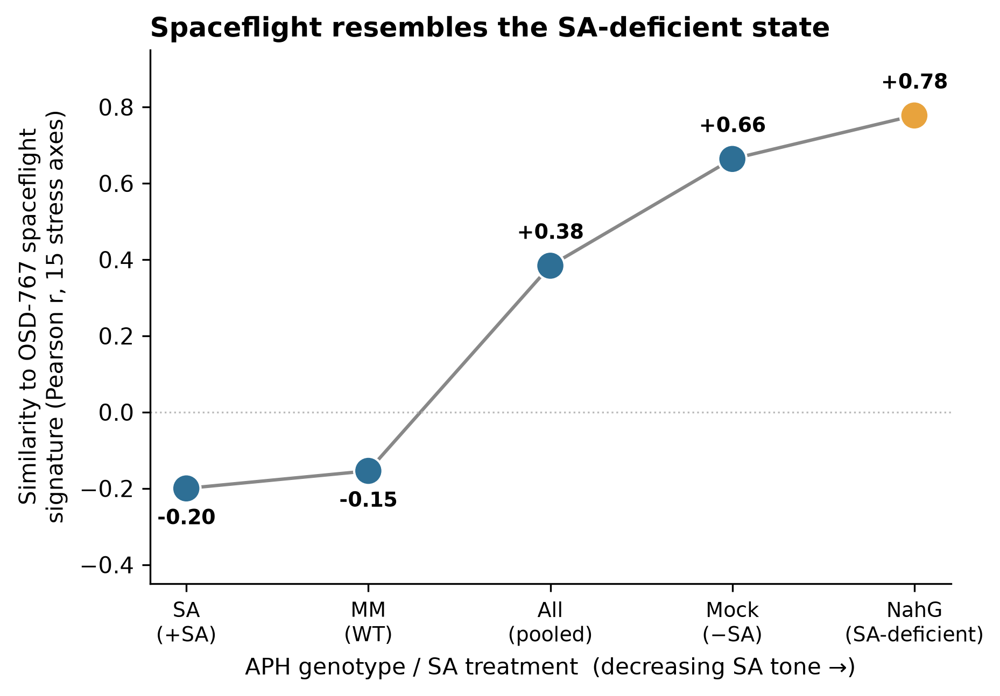
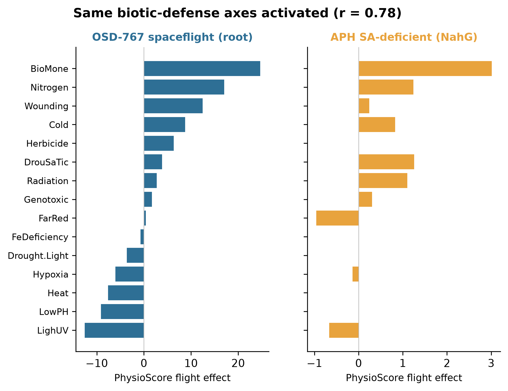
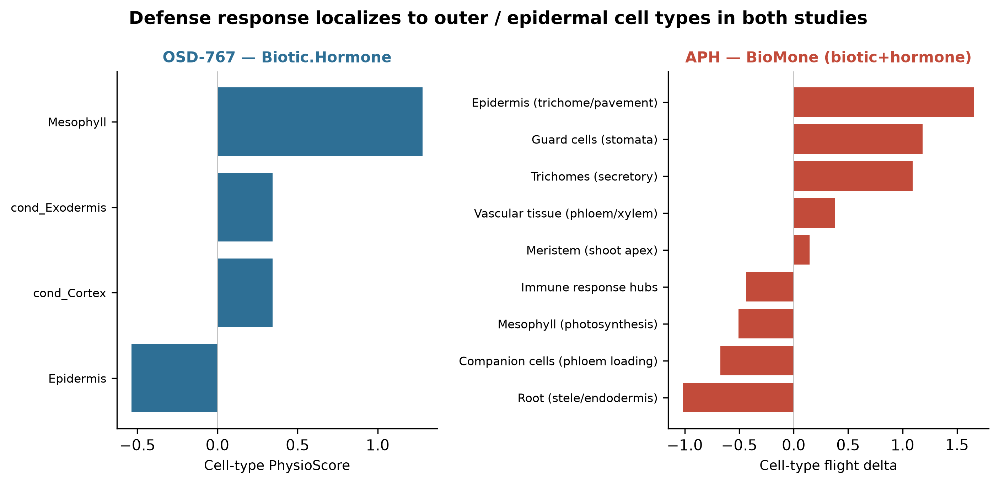

# Spaceflight drives tomato into a salicylic-acid–deficient, biotic-defense-primed transcriptional state: a cross-mission integration

Richard Barker¹ [+ OSD-767 and APH study co-authors]

¹ Purdue University, West Lafayette, IN, USA

*Figure 1. Graphical summary. Two independent ISS tomato experiments are projected into a shared Plant PhysioSpace; the OSD-767 spaceflight signature matches the APH SA-deficient (NahG) state (r = 0.78), placing spaceflight at the low-SA, defense-primed pole.*

## Abstract

Spaceflight reproducibly perturbs the plant transcriptome, yet individual differentially
expressed genes rarely replicate across missions, hardware, and cultivars — leaving open
what, if anything, is conserved. We integrated two independent International Space Station
tomato RNA-seq experiments: OSD-767 (VEG-05 chamber; red/blue light × spaceflight; leaf and
root) and an Advanced Plant Habitat study manipulating salicylic-acid (SA) signalling
(wild-type MoneyMaker vs SA-deficient *NahG*, ± exogenous SA × spaceflight). At the
individual-gene level the two leaf spaceflight responses were uncorrelated (Spearman ρ =
0.05; 9 shared DEGs). However, projecting both studies into a shared Plant PhysioSpace
revealed a strongly conserved **stress-pattern** response dominated by biotic/hormone,
nitrogen and cold axes with light/UV suppression. Critically, the OSD-767 spaceflight
signature matched the **SA-deficient (*NahG*)** state (Pearson r = 0.78, p = 0.001) far more
than wild-type (r = −0.15), and similarity to the spaceflight signature increased
monotonically as SA tone fell (SA −0.20 → wild-type −0.15 → Mock +0.66 → *NahG* +0.78). In
both studies the response localized to outer/epidermal cell types. We conclude that
spaceflight pushes tomato into an SA-deficient–like, biotic-defense-primed transcriptional
state, and that SA signalling is a conserved causal buffer of that response — a pattern-level
principle that is robust where gene-level signatures are not.

## 1. Introduction

Plants are central to bioregenerative life-support systems for long-duration human
spaceflight, providing food, atmospheric regeneration, water recycling, and psychological
benefit. Realising that role requires understanding how the spaceflight environment — the
combination of microgravity, elevated ionising radiation, modified cabin atmosphere, and
confined-volume handling — reprograms plant physiology. Two decades of orbital
transcriptomics have established that spaceflight elicits broad changes in stress, cell-wall,
and hormone-signalling genes across Arabidopsis, rice, and tomato. Yet a persistent and
uncomfortable feature of this literature is that the specific genes called as
spaceflight-responsive seldom reproduce from one experiment to the next: differences in
cultivar, growth hardware, light regime, harvest timing, and bioinformatic pipeline appear
to dominate gene-level results. This non-reproducibility has limited the field's ability to
state what is *biologically conserved* about the plant response to space, as opposed to what
is idiosyncratic to a given flight.

Two recent ISS tomato (*Solanum lycopersicum*) experiments approach this problem from
complementary directions. The **OSD-767** study, conducted in the VEG-05 chamber, crossed
light quality (red vs blue LED) with spaceflight across leaf and root tissues. Using
PhysioSpace stress-pattern decoding it identified a biotic/hormone (salicylic-acid–type)
defense signature that was strongest in the root, amplified by blue light — a striking but
fundamentally *correlational* observation, because the experiment did not manipulate
defense signalling itself. The **Advanced Plant Habitat (APH)** study took the opposite,
*interventional* approach: it grew wild-type MoneyMaker alongside the SA-deficient *NahG*
transgenic (which degrades SA via a bacterial salicylate hydroxylase), with and without
exogenous SA, under spaceflight. It found that removing SA (*NahG*) amplified the
spaceflight transcriptional response ~6.6-fold and produced a biotic/wounding-like
PhysioSpace signature — direct evidence that SA status governs the *magnitude* of the
response.

That both studies independently implicate the same SA/biotic-defense axis, and both express
their results in the same Plant PhysioSpace coordinate system, presents a rare opportunity:
to test whether two spaceflight experiments converge despite differing in cultivar, chamber,
mission, and sequencing pipeline, and to ask whether SA is the unifying variable. We
hypothesised that conservation would emerge at the level of *stress patterns* rather than
individual genes, and — given OSD-767's lack of SA manipulation yet strong defense signature
— that the unperturbed spaceflight response would resemble the SA-*deficient* state defined
by APH. Because study identity is perfectly confounded with cultivar, chamber, and
quantifier, we integrate on relative quantities (fold-changes and PhysioSpace patterns) and
define conserved signal as that which replicates across both studies in spite of these
differences (Fig. 1).

## 2. Results

### 2.1 Leaf spaceflight responses do not replicate at the gene level
Across 16,516 genes shared between the two studies, leaf Flight-vs-Ground log2 fold-changes
were essentially uncorrelated (Spearman ρ = 0.05; Pearson r = 0.02; genome-wide sign
concordance 0.51, indistinguishable from chance), and only 9 genes were significant in both
studies (Fig. 4). At the level of the individual transcript, then, the two leaf spaceflight
responses share almost nothing — consistent with the broader reproducibility problem in
plant spaceflight transcriptomics and confirming that the differentially expressed gene is
not the appropriate unit for cross-mission comparison.

*Figure 4. Gene-level non-replication of leaf Flight-vs-Ground fold-changes between OSD-767 and APH (Spearman ρ = 0.05).*

### 2.2 A conserved stress-pattern response across studies
Projecting both studies into the shared 15-axis Plant PhysioSpace exposed a reproducible
signature where the gene level showed none. Under spaceflight, the biotic+hormone (BioMone),
nitrogen, and cold axes were co-activated while the light/UV axis was co-suppressed, in both
datasets (Fig. 3). Consistent with the original OSD-767 report, its defense signal was
root-led (BioMone Flight effect +34/+15 in root under blue/red light versus +9/+1 in leaf),
underscoring that the conserved axis is organ- as well as pattern-specific.

*Figure 3. Conserved spaceflight stress-pattern axes (flight effect, z-scored within study) for OSD-767 (root, leaf) and APH (MM, Mock, SA, NahG). Biotic/hormone, nitrogen and cold are co-activated; light/UV is co-suppressed.*

### 2.3 The spaceflight signature matches the SA-deficient state
The OSD-767 spaceflight stress-pattern signature correlated strongly with the APH
**SA-deficient (*NahG*)** signature (Pearson r = 0.78, p = 0.001; Spearman 0.75) but showed no
relationship to wild-type MoneyMaker (r = −0.15). Ordering the APH groups by SA tone revealed
a monotonic gradient: similarity to the spaceflight signature rose steadily as SA fell — from
SA-treated (−0.20) and wild-type (−0.15) through the pooled (+0.38) and mock (+0.66) groups to
*NahG* (+0.78; Fig. 2). In other words, the less SA present in the experimental system, the
more closely it resembled spaceflight.

*Figure 2. SA-status gradient: similarity (Pearson r across 15 PhysioSpace axes) of the OSD-767 spaceflight signature to APH groups ordered by decreasing SA tone. The relationship is monotonic, peaking at the SA-deficient NahG line.*

### 2.4 SA signalling as the conserved causal buffer
OSD-767 applied no SA manipulation, yet its spaceflight signature resembled the *NahG*
(SA-removed) state; APH shows directly that *NahG* amplifies, and SA suppresses, the same
biotic-defense response. The parsimonious synthesis is therefore causal: spaceflight itself
drives tomato into a functionally SA-deficient, biotic-defense-primed transcriptional state,
which endogenous SA signalling normally opposes. The two studies activate the same conserved
axes — biotic/hormone, nitrogen, cold — under flight (Fig. 5).

*Figure 5. Conserved biotic-defense axis profile: OSD-767 spaceflight (root) versus APH SA-deficient (NahG). The same axes are activated in both (r = 0.78).*

### 2.5 The defense response localizes to outer/epidermal cells in both studies
Cell-type projection placed the defense axis in outer and surface cell types in both
datasets — OSD-767 exodermis and cortex (outer root layers), and APH epidermis, trichome,
and guard cells (Fig. 6) — consistent with a barrier/surface-tissue defense program engaged
at the tissue periphery, where mechanical and environmental stress are greatest.

*Figure 6. Cell-type localization of the defense (biotic/hormone) axis: both studies place it in outer/epidermal cell types.*

## 3. Discussion

The central result of this integration is a dissociation between two levels of biological
description. At the gene level, two ISS tomato spaceflight experiments are effectively
uncorrelated; at the stress-pattern level, decoded through a shared PhysioSpace, they
converge on a common biotic-defense signature. This argues that **stress-pattern decoding,
not differentially expressed gene lists, is the appropriate currency for cross-mission plant
spaceflight meta-analysis.** Gene-level overlap statistics — still the default summary in many
flight studies — will systematically under-report conservation and can make biologically
concordant experiments look contradictory. Pattern-level projection abstracts away the
cultivar-, hardware-, and pipeline-specific identity of individual transcripts while
retaining the coordinated physiological program they encode.

The more specific conclusion is that the spaceflight transcriptome resembles a
**salicylic-acid–deficient state**. This emerges not from a single comparison but from a
dose-response: across five APH groups spanning the SA-tone spectrum, similarity to the
unmanipulated OSD-767 spaceflight signature increases monotonically as SA decreases, reaching
its maximum in the *NahG* line that cannot accumulate SA. Two mechanistic interpretations are
compatible with this pattern. Spaceflight may actively suppress SA biosynthesis or signalling
— for example through altered expression of isochorismate-pathway or *NPR1*-dependent
components — producing a genuinely SA-depleted tissue; or it may phenocopy SA deficiency
downstream, de-repressing biotic-defense programs that SA normally restrains. The two are
distinguishable experimentally by direct SA quantitation in flight-grown tissue and by the
SA-supplementation arm that APH has already begun; our integration motivates both as priority
follow-ups. Either way, the convergence reframes the well-known "spaceflight stress response"
in tomato as, in substantial part, a defense-priming response gated by SA tone.

This view is reinforced by the cell-type analysis, which independently localizes the defense
axis to outer and epidermal tissues in both studies. Surface and barrier cell types are the
plant's first line of contact with mechanical, microbial, and atmospheric stress, and their
prominence here is consistent with OSD-767's original observation that the outer root cortex
bears a disproportionate share of the spaceflight transcriptional burden. A defense program
concentrated at the tissue periphery is what one would expect if the spaceflight environment
is read, at least in part, as a biotic/abiotic threat at the plant surface.

The practical implication for space agriculture is concrete. If endogenous SA buffers a
defense-stress burden that spaceflight imposes, then managing SA tone — through genetics,
priming, or exogenous application — becomes a candidate lever for improving crop performance
in flight, potentially reallocating resources from constitutive defense toward growth and
yield. This hypothesis is directly testable in the existing hardware.

Several limitations frame these conclusions. Study identity is perfectly confounded with
cultivar (MoneyMaker vs the VEG-05 line), chamber (APH vs VEG-05), and quantifier (STAR vs
RSEM); our design deliberately does not attempt to separate these, and instead treats the
signal that survives all of them as the conserved core. The integration rests on two missions
only, and PhysioSpace is a correlational pattern-matching method whose resolution depends on
cross-species ortholog coverage. Finally, the conserved-defense conclusion is strongest for
the biotic/hormone, nitrogen and cold axes; other axes (e.g. light/UV) behave tissue- and
condition-specifically and should not be over-interpreted. As additional plant spaceflight
datasets are decoded into a common PhysioSpace, this integration provides both a template and
a falsifiable prediction: new missions should land toward the low-SA, defense-primed pole, and
manipulating SA should move them along it.

## 4. Methods
See `docs/methods.md`. Integration code and all result tables/figures are in this repository;
a Zenodo DOI will be minted on acceptance.

## 5. Data and code availability
Derived inputs from OSD-767 and the APH study are documented in `docs/PROVENANCE.md`; raw
reads reside on NASA GeneLab (OSD-767; APH OSD-# *to confirm*). All integration code is in
this repository (`run_pipeline.py`).

## Figure legends
- **Figure 1.** Graphical summary / concept schematic: spaceflight resembles the SA-deficient state.
- **Figure 2.** SA-status gradient (similarity of the OSD-767 spaceflight signature to APH groups by SA tone).
- **Figure 3.** Conserved spaceflight stress-pattern axes across both studies.
- **Figure 4.** Gene-level non-replication of leaf Flight-vs-Ground fold-changes.
- **Figure 5.** Conserved biotic-defense axis profile: OSD-767 spaceflight (root) vs APH NahG.
- **Figure 6.** Cell-type localization of the defense axis in both studies.
